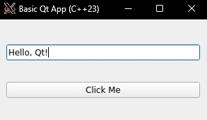

# BasicQtApp

**BasicQtApp** is a simple GUI application built with Qt5 and C++23. The application demonstrates a basic interface with a text field and a button, using modern C++23 features such as `std::format`.

## Sample



## Features

- **Qt5 Widgets:** The application uses Qt5 for its graphical interface.
- **C++23 Features:** The app leverages the `std::format` feature introduced in C++23.
- **Simple GUI:** The application includes a text input field and a button. When the button is clicked, the content of the text field is printed to the console.

## Prerequisites

Ensure you have the following installed on your system:

- **C++ Compiler:** A compiler that supports C++23 (e.g., `g++-13` or newer).
- **CMake:** Version 3.20 or higher.
- **Qt5:** Installed with the necessary components (`Widgets`).

## Build Instructions

1. Clone this repository and navigate to the project directory:

    ```bash
    git clone git@github.com:cschladetsch/BasicQt.git
    cd BasicQtApp
    ```

2. Create a build directory and run CMake:

    ```bash
    mkdir build
    cd build
    cmake ..
    ```

3. Build the project using `make`:

    ```bash
    make
    ```

4. Run the application:

    ```bash
    ./BasicQtApp
    ```

## Troubleshooting

If you encounter a library version mismatch (e.g., `GLIBCXX_3.4.31 not found`), you can run the application using your system libraries by adjusting the `LD_LIBRARY_PATH`:

```bash
LD_LIBRARY_PATH=/usr/lib/x86_64-linux-gnu:$LD_LIBRARY_PATH ./BasicQtApp
```

## File Structure

- `main.cpp`: Contains the source code for the main application, including a text field and button.
- `CMakeLists.txt`: CMake configuration for building the project【20†source】【21†source】.
- `.gitignore`: Ignores build-related files【19†source】.

## License

This project is licensed under the MIT License. See the LICENSE file for details.
